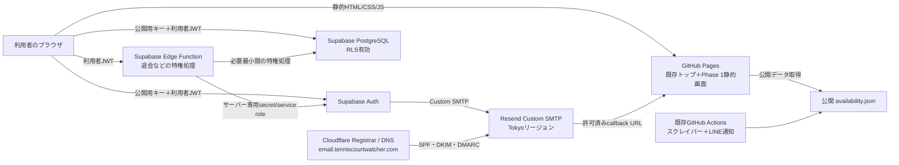
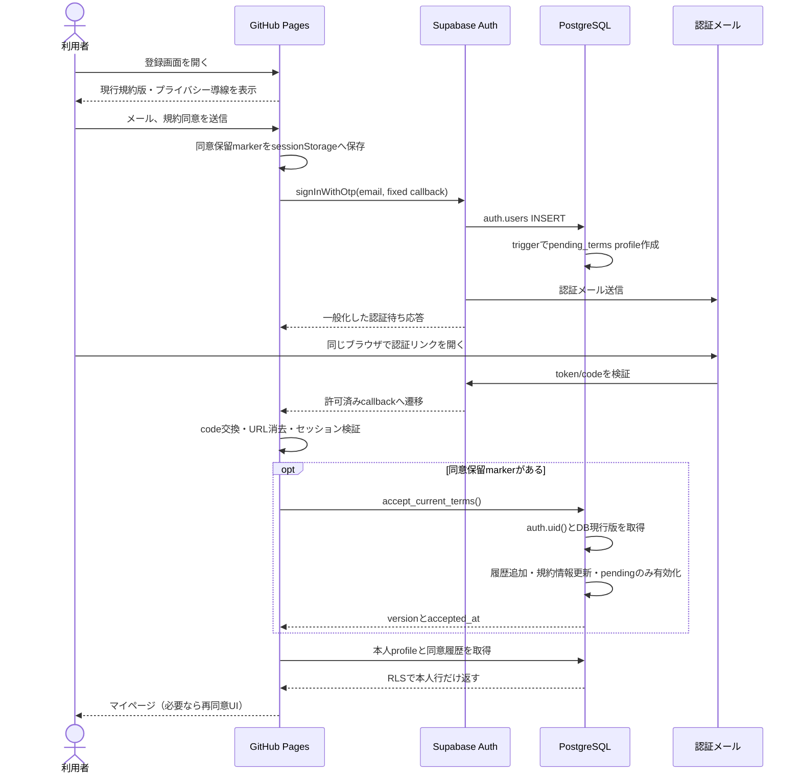
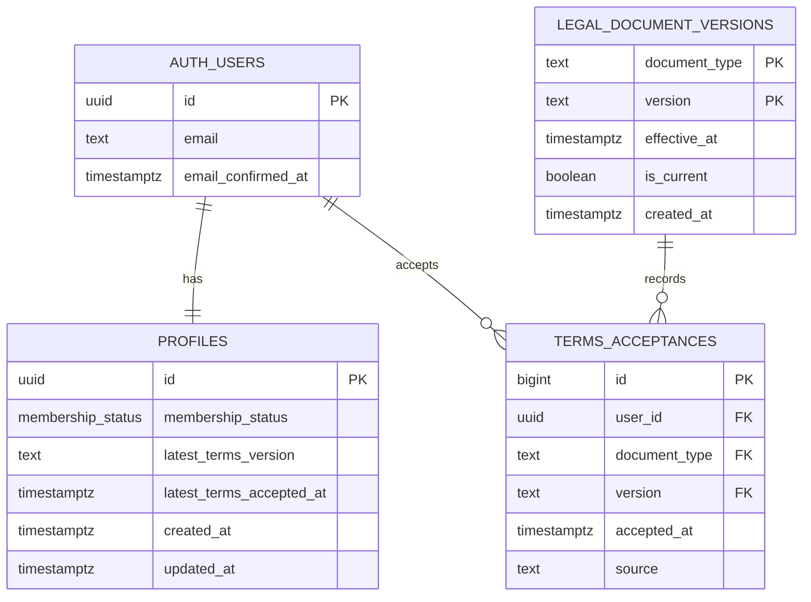

# Phase 1 会員登録・利用規約同意・メール認証 技術設計

## 0. 文書情報

| 項目 | 内容 |
| --- | --- |
| 対象 | Tennis Court Watcher Phase 1 会員基盤 |
| 状態 | Phase 1完成済み。Supabase Authマジックリンク・PKCE、会員profile、規約版・同意履歴、RLS、同意RPC、最小限のマイページ、Resend Custom SMTPによる日本語認証メールを本番確認済み |
| 作成日 | 2026-08-04 |
| 方針決定日 | 2026-08-04 |
| 前提文書 | [Project Vision](./PROJECT_VISION.md)、[Development Roadmap](./DEVELOPMENT_ROADMAP.md)、[Service Specification](./SERVICE_SPECIFICATION.md)、[Auth Email Operations](./AUTH_EMAIL_OPERATIONS.md) |

本書はPhase 1の実装境界、認証・認可、データ、画面、テスト、段階導入を定義する。Supabase Auth/PostgreSQLを正式採用し、GitHub Pages上の静的フロントエンドからブラウザ公開用キーで接続する。認証メールはCloudflare Registrarで管理する送信用サブドメインと、TokyoリージョンのResend Custom SMTPを採用済みである。Supabaseの料金枠など、明記した未決項目は引き続き**要決定**である。

### 0.1 決定済み事項

| 決定事項 | 決定内容 | 決定日 |
| --- | --- | --- |
| 会員基盤 | Supabase Auth/PostgreSQLを正式採用する | 2026-08-04 |
| 認証方式 | メールのマジックリンクを使用し、パスワード認証はPhase 1で使用しない | 2026-08-04 |
| トークン交換 | PKCEを採用し、callbackでcodeをセッションへ交換する | 2026-08-04 |
| ホスティング | GitHub Pagesを継続する | 2026-08-04 |
| ブラウザSDK | `@supabase/supabase-js@2.106.2` に固定する | 2026-08-04 |
| 公開設定 | GitHub Actions Repository Variablesの3値からPagesデプロイ時に生成する | 2026-08-04 |
| 法務ページ | 会員登録の一般公開前に利用規約とプライバシーポリシーの暫定初版を作成し、内容確認を完了する | 2026-08-04 |
| Phase 1範囲 | 利用規約同意、会員登録、メール認証、ログイン、ログアウト、最小限のマイページ、退会に限定する | 2026-08-04 |
| Phase 1対象外 | 通知条件、利用者別通知、LINE連携、課金は実装しない | 2026-08-04 |
| ドメイン管理 | 独自ドメイン `tenniscourtwatcher.com` をCloudflare Registrarで管理する | 2026-08-06 |
| 認証メール配信 | TokyoリージョンのResendをSupabase Custom SMTPとして採用する | 2026-08-06 |
| 送信ドメイン | `email.tenniscourtwatcher.com` を使用し、SPF・DKIM・DMARCを認証する | 2026-08-06 |
| 送信元 | 表示名 `Tennis Court Watcher`、アドレス `no-reply@email.tenniscourtwatcher.com` とする | 2026-08-06 |
| メールテンプレート | 初回登録はConfirm sign up、登録済みユーザーの通常ログインはMagic link or OTPの日本語テンプレートを使用する | 2026-08-06 |

## 1. 現在の構成と制約

### 1.1 現行Phase 0

現在の稼働系は次の構成である。

- ルートの `index.html` はフレームワークやビルドを必要としない静的ページであり、相対URLの `data/availability.json` を読み込む。
- `scripts/scrape.py` はPython/Playwrightで鹿児島市の3施設を取得し、公開用 `data/availability.json` と既存LINE通知用 `data/notification-state.json` を生成する。
- 既存LINE通知は `LINE_CHANNEL_ACCESS_TOKEN` と単一の `LINE_USER_ID` をGitHub Actions Secretsから受け取る。これは利用者別通知ではない。
- `.github/workflows/update-availability.yml` はpytest、スクレイピング、診断Artifact、2つのJSONの更新、GitHub Pagesデプロイを行う。
- Pagesは既存トップと公開JSONに加え、`auth`、`account`、`legal`、`assets` を同じArtifactから配信する。
- `tests/` はPhase 0回帰に加え、公開設定生成、必須変数、秘密鍵拒否、マジックリンク送信、PKCE callback、セッション確認、ログアウト、console非露出を検証する。
- Supabase Authのブラウザ接続に加え、会員データベース、RLS、規約同意RPC、通知設定、退会Edge Functionを実装済みである。退会Edge Functionは2026-08-20に本番deployとproduction acceptanceを完了した。
- `.gitignore` は `.env` 系、`assets/config/auth-config.js`、secret候補ファイル、Supabase CLI一時状態を除外する。

### 1.2 Phase 1で守る境界

Phase 1は次を不変条件とする。

1. 既存の `index.html`、公開JSONのスキーマと相対パスを変更しない。
2. `scripts/scrape.py` に会員・認証・個人情報への依存を追加しない。
3. `data/availability.json` と `data/notification-state.json` に会員情報を追加しない。
4. 既存LINE通知のSecret、通知先、差分判定、再試行方針を変更しない。
5. 会員基盤の障害時も、Phase 0の取得・表示・既存LINE通知を継続できる。
6. Pages Artifact、Actions Artifact、リポジトリ、Issue、テストfixtureへ個人情報を保存しない。
7. GPS位置情報を取得せず、地域制限にも使用しない。

### 1.3 GitHub Pages固有の制約

- サーバー側レンダリング、任意のAPI処理、HTTP-only Cookieの発行はGitHub Pages単体では行えない。
- GitHub Pagesのプロジェクトサイトでは、公開URLにリポジトリ名のベースパスが入る可能性がある。サイト内リンクを `/auth/login.html` のようなドメインルート固定にせず、相対URLで記述する。
- 保護ページのHTML/JavaScript自体は誰でも取得できる。「画面を隠すこと」を認可にせず、データ取得時のRLSを最終的な認可境界にする。
- ブラウザ実行のためセッションはJavaScriptから利用可能なストレージに保持される。XSS対策と依存関係固定が必須である。認証画面から読み込む外部スクリプトは、固定バージョンのSupabase公式配布パッケージに限定し、広告・分析・未知の第三者スクリプトを置かない。HTTP-only Cookieを必須要件とする場合はGitHub Pagesのみの構成では満たせず、ホスティング構成を再検討する必要があるため**要決定**とする。
- GitHub Pagesでは任意のレスポンスヘッダーを設定できない。CSPはHTMLの `meta` で可能な範囲を適用するが、`frame-ancestors` などレスポンスヘッダーが必要な対策をどう補うかは**要決定**である。

## 2. Phase 1の対象機能

| 機能 | Phase 1の範囲 |
| --- | --- |
| 新規会員登録 | メールアドレスを入力し、現行利用規約へ明示的に同意してマジックリンク送信を開始する |
| 利用規約への同意 | チェックを初期OFF・必須とし、規約バージョンとDB時刻による同意日時を履歴保存する |
| プライバシーポリシーの確認 | 登録前に到達しやすい公開ページとリンクを提示する。別途同意チェックを必須にするかは**要決定** |
| メール認証 | マジックリンクメール、認証待ち、再送、成功、期限切れ・無効リンク時の再試行導線を提供する |
| ログイン | メール認証済みかつ有効な会員が、メールアドレスへ届くマジックリンクでログインする |
| ログアウト | 操作中ブラウザのローカルセッションだけを終了し、会員情報を画面から消去してログイン画面へ戻る |
| 最小限のマイページ | 自分の会員状態、メール認証状態、同意規約バージョン・日時、問い合わせ、ログアウト、退会導線を表示する |
| 退会 | 本人確認後に会員を即時ロックし、サーバー側の特権処理でAuthユーザーと個人情報を削除または規定に従って匿名化する |

パスワード認証とパスワード再設定はPhase 1の対象外とする。表示名、メールアドレス変更、全端末ログアウトをPhase 1へ含めるかは**要決定**である。

### 2.1 今回実装した境界

- ログイン画面でメール形式と利用規約同意を確認し、条件成立時だけ `signInWithOtp` を実行する。
- ログイン画面はフォームを初期状態で隠して `getSession` を先に実行し、既存セッションがあればマイページへ `replace` 遷移する。セッションがない場合と確認失敗時だけフォームを利用可能にし、確認失敗時は一般化した案内を表示する。
- callbackでURLの `code` を読み、直ちに認証パラメータを消去して `exchangeCodeForSession` を実行する。
- マイページは `getSession` で未認証者をログイン画面へ戻し、Authセッションのメール・認証状態と、RLS経由の本人profile・同意履歴を表示する。
- `signOut({ scope: "local" })` で操作中ブラウザのセッションだけを終了する。全端末ログアウトは行わない。
- 成功・失敗表示はアカウントの存在を区別せず、メールアドレス、認証URL、code、access token、refresh tokenをconsoleへ出さない。
- `legal_document_versions`、`profiles`、追記専用の `terms_acceptances`、新規ユーザーtrigger、既存ユーザーbackfillをmigration化した。
- 本人SELECTだけを許可するRLSと、現行規約をDBから取得して同意履歴とprofileを同一トランザクションで更新する引数なしRPCを実装した。
- ログイン成功時の同意保留marker、callbackでの同意RPC、失敗時のマイページ再同意、profile・同意履歴表示を実装した。
- 退会は2026-08-19にEdge Functionと二段階確認UIを実装し、2026-08-20に本番deployとproduction acceptanceを完了した。Phase 4のLINE連携と課金は引き続き実装境界外である。

## 3. Phase 1の対象外

- 通知条件設定
- 利用者別メール通知
- LINEアカウント連携、LINE Login、利用者別LINE通知
- 有料プラン、決済、契約管理
- ソーシャルログイン、多要素認証
- 自動予約、予約代行
- GPSによる地域判定・地域制限
- 本格的な管理画面
- Phase 0のスクレイパー、公開JSON、既存LINE通知のDB移行

認証メールはPhase 1に含むが、空き情報を送る利用者別メール通知とは責務・配信目的・テンプレートを分離する。

## 4. Supabase Auth・PostgreSQLを利用する構成

### 4.1 決定構成



### 4.2 責務

| コンポーネント | 責務 | 禁止事項 |
| --- | --- | --- |
| GitHub Pages | 登録・認証・ログイン・マイページのUI、公開用キーを使ったAuth/Data API呼び出し | 認可の最終判断、service role/secret keyの保持 |
| Supabase Auth | マジックリンク発行、メール確認、ログイン、セッション、Authユーザー削除 | 利用規約本文の公開元、Phase 0の空き取得 |
| Resend | Supabase Custom SMTPの受け付け、認証メール配信、配信イベントの提供 | 会員認証、受信メール運用 |
| Cloudflare Registrar / DNS | ドメイン登録の自動更新、送信用サブドメインのSPF・DKIM・DMARC公開 | 認証テンプレート、Authユーザー管理 |
| PostgreSQL | プロフィール、規約版、同意履歴、RLS、会員状態 | メールアドレスや認証情報の重複保存 |
| DB Trigger / RPC | Authユーザー作成時のpending profile作成、現行規約の取得、同意履歴とprofileの同一トランザクション更新 | `raw_user_meta_data` やクライアント送信の利用者ID・同意日時を信用すること |
| Edge Function | 退会など、Auth Admin権限が必要な処理 | 未認証呼び出し、リクエストの `user_id` を信用すること |
| GitHub Actions | 既存Phase 0の更新、将来の静的会員画面のビルド・追加配信 | 本番会員データの取得、service role keyのフロントエンド埋め込み |

### 4.3 Supabaseの初期設定方針

- Emailプロバイダーとマジックリンクを有効化し、パスワードによるログインUIは提供しない。
- メールリンクの検証を必須にする。検証を経ずにセッションを作成できる設定ではリリースしない。
- Anonymous sign-in、OAuth、電話番号認証はPhase 1では無効にする。
- 本番のSite URLとRedirect URLは正確なHTTPS URLを明示登録し、本番では広すぎるワイルドカードを使用しない。
- 開発・ステージング・本番は別プロジェクトに分離する案を推奨する。最低限、本番データをローカルやテストへ複製しない。
- Auth APIのレート制限とCAPTCHAの採否をリリース前に確認する。
- Supabase標準の試用メール送信には依存せず、TokyoリージョンのResend Custom SMTPを使用する。送信用サブドメインは `email.tenniscourtwatcher.com`、送信元は `Tennis Court Watcher <no-reply@email.tenniscourtwatcher.com>` とする。SMTP passwordにはドメイン限定Sending accessのResend APIキーを使用し、値はGitHub、Pages、Artifact、ログへ出さない。運用詳細は [Auth Email Operations](./AUTH_EMAIL_OPERATIONS.md) を参照する。
- Supabaseのリージョン、料金枠、バックアップ要件は**要決定**である。

## 5. GitHub Pagesとの接続方法

### 5.1 接続

ブラウザは、デプロイ時に生成した公開設定から次の値だけを読み、Supabase JavaScriptクライアントを初期化する。

- `SUPABASE_URL`
- `SUPABASE_PUBLISHABLE_KEY`（旧プロジェクトでは公開用 `anon` key）
- `AUTH_CALLBACK_URL`

公開用キーはブラウザに配布される識別値であり、秘密情報として保護できない。したがって、公開スキーマの全テーブルでRLSと最小権限Grantを必須とする。service role keyまたはSupabase secret keyはRLSを迂回するため、ブラウザ、HTML、JavaScript、Pages Artifact、リポジトリへ絶対に置かない。

### 5.2 デプロイの追加方針

実装時も既存Pages生成を置き換えず、次の順で加算する。

1. 現行どおり `_site/index.html` と `_site/data/availability.json` を生成する。
2. Phase 1の静的成果物を `_site/auth/`、`_site/account/`、`_site/legal/`、`_site/assets/` へ追加する。
3. Pagesジョブで `SUPABASE_URL`、`SUPABASE_PUBLISHABLE_KEY`、`AUTH_CALLBACK_URL` をRepository Variablesから受け取る。
4. `scripts/generate_auth_config.py` で `_site/assets/config/auth-config.js` を生成する。空値、HTTP(S)以外のURL、secret/service role形式、publishable keyでない値は拒否し、文字列はJavaScript向けに安全にエスケープする。
5. 3変数のいずれかが不正ならPagesデプロイを失敗させ、認証設定の欠けた成果物を公開しない。
6. Artifact内に既存トップ、公開JSON、Phase 1画面がすべて存在することをテストしてから、現行のPagesジョブでまとめてデプロイする。

認証設定不足時も取得・既存LINE通知・診断Artifactまでは継続するが、Pagesデプロイは失敗する。既存の公開済みPagesは新Artifactへ置き換わらない。

### 5.3 URLとセッション

- SupabaseのRedirect URLには本番・ステージング・ローカルのcallbackを個別登録する。
- callbackは許可済みの固定パスだけを使い、クエリから任意の遷移先を受け取らない。
- 認証コード、token hash、エラー情報を処理した直後に `history.replaceState` でURLから除去し、画面・console・分析基盤へ渡さない。
- 認証ページでは `Referrer-Policy: no-referrer` 相当を適用し、認証処理中のURLを外部へ送らない。
- 認証方式はメールのマジックリンク、トークン交換はPKCEとする。code verifierはリンク要求元ブラウザのストレージにあるため、原則として同じブラウザでリンクを開く必要がある。別端末・別ブラウザで失敗した場合は、利用するブラウザから再度リンクを要求するよう案内する。
- `persistSession: true` と `autoRefreshToken: true` により、同じブラウザではログアウトしない限り通常セッションを保持する。ブラウザを閉じても通常は次回そのまま利用できるが、ログアウト、ブラウザデータの削除、セッションの無効化、別端末・別ブラウザでは再認証が必要になる。
- ログインページはフォーム表示前に `getSession` で既存セッションを確認する。認証済みなら短い状態文を表示してマイページへ `replace` 遷移し、未認証または確認失敗ならフォームを表示する。この判定はUX上の経路制御だけに使い、DB認可はRLSを最終境界とする。
- マイページのログアウトは `scope: "local"` を指定し、操作中ブラウザのセッションだけを終了する。全端末ログアウト機能は設けない。
- access tokenとrefresh tokenをURL fragmentへ露出させるimplicit flowは採用候補から除外する。
- 認証URL、access token、refresh token、PKCE verifier、認証コードをログへ出さない。URL全体をエラー監視へ送る設定も禁止する。

## 6. 推奨ディレクトリ構成

既存ファイルを維持したまま、次を追加する案とする。

```text
.
├── index.html                         # Phase 0。空き表示と静的なマイページ導線
├── data/                              # Phase 0公開データ・通知状態
├── scripts/                           # Phase 0スクレイパー
├── tests/                             # Phase 0回帰テスト
├── auth/
│   ├── login.html                     # ログイン・会員登録
│   └── callback.html
├── account/
│   └── index.html                     # 最小限のマイページ
├── legal/
│   ├── terms.html
│   └── privacy.html
├── assets/
│   ├── css/auth.css
│   ├── js/auth-foundation.js
│   └── config/auth-config.example.js
├── scripts/
│   └── generate_auth_config.py        # ローカル・Pages共通の公開設定生成
├── supabase/
│   ├── config.toml
│   ├── migrations/
│   │   ├── <timestamp>_phase1_auth_schema.sql
│   │   ├── <timestamp>_phase1_auth_triggers.sql
│   │   └── <timestamp>_phase1_auth_rls.sql
│   ├── functions/delete-account/index.ts
│   └── tests/
│       ├── auth_schema.test.sql
│       └── auth_rls.test.sql
├── tests-auth/
│   ├── unit/
│   └── e2e/
├── package.json
├── package-lock.json
└── docs/PHASE1_AUTH_DESIGN.md
```

ブラウザSDKはSupabase公式ドキュメントで案内されるjsDelivr配布の `@supabase/supabase-js@2.106.2/dist/umd/supabase.js` に固定する。`@2` や `latest` のような可変指定は使わない。公開設定だけをデプロイ時に生成し、SDKやProject設定にsecret/service role keyを渡さない。

## 7. 画面とURLの構成

次のパスはPagesサイトのベースURLからの相対パスである。たとえばプロジェクトサイトなら、実URLは `https://<owner>.github.io/<repository>/auth/login.html` の形になる。

| 画面 | 相対URL | 公開範囲 | 主な状態 |
| --- | --- | --- | --- |
| 既存空き状況トップ | `./` | 公開 | Phase 0の空き表示と、マイページへの静的リンク |
| 利用規約 | `legal/terms.html` | 公開 | 暫定案。一般公開前に内容、版番号、発効日を確認 |
| プライバシーポリシー | `legal/privacy.html` | 公開 | 暫定案。一般公開前に取得項目、目的、保管、第三者提供、問い合わせを確認 |
| 新規会員登録・ログイン | `auth/login.html` | 公開 | 既存セッション確認、メール入力、規約同意、マジックリンク送信 |
| メール認証callback | `auth/callback.html` | 公開 | 処理中、成功、期限切れ、無効、再送 |
| マイページ | `account/index.html` | 認証・有効会員限定 | 本人の状態、規約同意、ログアウト、退会導線 |

未認証者が `account/index.html` を開いた場合は、保護情報を描画せずログインへ遷移する。遷移先を保持する場合も、サイト内の許可済みパスだけを識別子で指定し、外部URLを受け付けない。

## 8. 会員登録からメール認証完了までのシーケンス

次図のうち、現在はAuthユーザー作成時のprofile triggerと、callbackまたはマイページから呼ぶ同意RPCを採用している。Before User Created Hookは使用せず、同意の確定は認証セッション確立後に行う。



### 8.1 一貫性

- 登録画面は同意チェックなしで送信ボタンを有効にしないが、クライアント検証だけに依存しない。
- `auth.users` のafter insert triggerは `new.id` だけから `pending_terms` のprofileを作成する。profile作成失敗時はAuthユーザー作成も同一トランザクションで失敗する。
- `raw_user_meta_data` と `user_metadata` は認可や同意の確定に使用しない。
- 認証後の `accept_current_terms()` は引数を取らず、`auth.uid()` とDB上の現行規約版を使用する。
- 同意履歴追加とprofileの規約情報更新を同一RPCトランザクションで行い、`pending_terms` の場合だけ `active` へ遷移させる。同一版への再実行は一意制約と `ON CONFLICT DO NOTHING` で冪等にする。
- `accepted_at` をクライアントから受け取らず、DBの `timestamptz` デフォルトで記録する。
- メール認証完了は `auth.users.email_confirmed_at` を正とし、同意RPC成功時に `pending_terms` だけを `active` にする。規約同意は `suspended` や `withdrawal_pending` を解除せず、`active` はそのまま維持する。
- trigger障害は登録自体を止め得るため、ローカル・ステージングで異常系まで検証してから本番反映する。

### 8.2 エラー表示

- 「登録済み」「メールが存在しない」「未認証」を第三者が判別しやすい文言にしない。
- メール認証待ち画面へメールアドレスを渡す場合はメモリ内またはマスク済み表示に限定し、URL、ログ、HTMLへ埋め込まない。
- 同一利用者への再送はSupabase Custom SMTPの最小送信間隔に合わせ、前回の要求から60秒以上空ける。

### 8.3 認証メールテンプレート

- 初回登録にはConfirm sign upテンプレートを使用し、メールアドレスの確認とログインが完了することを案内する。
- 登録済みユーザーの通常ログインにはMagic link or OTPテンプレートを使用し、短時間・一度のみ有効なログインリンクであることを案内する。
- どちらも日本語テンプレートとし、送信専用であること、心当たりがなければ削除することを明記する。
- Magic link or OTPでは、同じブラウザではログアウトしない限り通常セッションが保持されるUXを案内する。
- Supabaseテンプレート変数 `{{ .ConfirmationURL }}` は変更しない。現在の件名と再現可能なHTMLは [Auth Email Operations](./AUTH_EMAIL_OPERATIONS.md#14-認証メールテンプレート) を正とする。

## 9. データモデル

### 9.1 Phase 1論理モデル



### 9.2 設計原則

- メールアドレスと認証情報は `auth.users` だけに保持し、`profiles` へ重複保存しない。
- 日時はすべて `timestamptz`、保存時はUTC、表示時は利用者向けタイムゾーンで変換する。
- `auth.users.id` と各テーブルの `user_id` を唯一の会員結合キーにする。
- 規約本文は公開可能な版管理ファイルとしてGit管理し、DBには版、公開URI、SHA-256ハッシュを保存する。公開済み版は上書きせず、新版を追加する。
- IPアドレスとUser-Agentを同意証跡に保存するかは、証跡価値と個人情報最小化を比較して**要決定**とする。既定案はPhase 1では保存しない。
- プライバシーポリシーも版管理する。確認履歴を別テーブルへ保存するか、同意ではなく提示記録だけとするかは法務確認後に**要決定**とする。

## 10. `profiles` テーブル

正式名称は `public.profiles` とする。

| 列 | 型 | NULL | 制約・用途 |
| --- | --- | --- | --- |
| `id` | `uuid` | 不可 | PK、`auth.users(id)` FK、`ON DELETE CASCADE` |
| `membership_status` | `membership_status` | 不可 | `pending_terms`、`active`、`withdrawal_pending`、`suspended`。初期値は `pending_terms` |
| `latest_terms_version` | `text` | 可 | 最新の同意規約版 |
| `latest_terms_accepted_at` | `timestamptz` | 可 | 最新の規約同意DB時刻 |
| `created_at` | `timestamptz` | 不可 | DB default `now()` |
| `updated_at` | `timestamptz` | 不可 | DB triggerで更新 |

Phase 1で編集可能なプロフィール項目は設けないことを初期案とする。表示名を収集する必要性は**要決定**であり、目的が確定するまで列を追加しない。メール認証時刻は `auth.users.email_confirmed_at` を正とし、マイページでは本人のAuth user情報から表示する。

`membership_status` と規約列はクライアントから直接更新できない。同意RPCは `pending_terms` だけを `active` にし、`active`、`suspended`、`withdrawal_pending` は元の状態を維持したまま最新同意情報を更新する。規約同意を停止解除や退会取消しの手段として扱わない。

## 11. 利用規約同意履歴の保持方法

### 11.1 `legal_document_versions`

- 主キーは `(document_type, version)` とし、今回の `document_type` は `terms` だけとする。
- `(document_type) where is_current` の部分一意indexで、同種文書の現行版を1件に制限する。
- 開発用初期版は `2026-08-04-draft`。一般公開前に正式版を追加し、currentを切り替えて再同意を求める。
- ブラウザroleには書込み権限を与えない。

### 11.2 `terms_acceptances`

| 列 | 型 | 用途 |
| --- | --- | --- |
| `id` | `bigint` | identity PK、DB生成 |
| `user_id` | `uuid` | `auth.users(id)` FK |
| `document_type` | `text` | 現在は `terms` |
| `version` | `text` | `legal_document_versions` との複合FK |
| `accepted_at` | `timestamptz` | DB時刻 |
| `source` | `text` | 現在は `web` |

`unique(user_id, document_type, version)` を設け、再試行で同一同意を重複させない。同意履歴は本人が参照できるが、ブラウザroleへINSERT/UPDATE/DELETEをGrantせず、同意RPCだけが追加する。規約改定時は過去行を上書きしない。

現行の退会実装ではAuthユーザーのhard deleteに伴うFK cascadeで同意履歴も削除し、2026-08-20のproduction acceptanceで削除を確認した。バックアップ等に残る同意証跡の保持期間、匿名化方法、法的必要性は一般公開前の法務・プライバシー最終化事項として引き続き**要決定**である。

## 12. Row Level Securityの方針

1. Data APIから到達できる `public` スキーマの全テーブルでRLSを明示的に有効化する。
2. RLS有効化だけでなく、`anon` と `authenticated` のテーブル・列権限を最小化する。
3. `anon` は今回の3テーブルへ一切アクセスさせない。公開規約本文は静的な `legal/terms.html` で提供する。
4. `authenticated` は自分の行だけ参照可能とする。
5. `profiles.membership_status`、規約情報、`terms_acceptances` はクライアントから直接更新させない。
6. 全利用者所有テーブルのポリシーは `auth.uid()` と行の `user_id` を比較する。URLやリクエスト本文の `user_id` を認可に使わない。
7. Phase 2以降の利用者所有テーブルでも、所有者が `active` であることを確認する共通方針を採用し、退会ロック直後から既存JWTによるアクセスを拒否する。
8. service role/secret keyを使う処理はRLSを迂回するため、Edge Function内でも利用者JWTを検証し、対象IDを認証済み利用者から導出する。
9. Viewを公開する場合はRLS迂回を避けるため `security_invoker` を検討し、不要なViewは公開スキーマに作らない。
10. RLSポリシー、Grant、trigger、DB関数をマイグレーションとしてレビューし、Dashboard上だけの手作業にしない。

## 13. 認証済みユーザーだけが自分の情報を参照できるポリシー

実装した本人SELECTポリシーの要点は次のとおりである。

```sql
alter table public.profiles enable row level security;

create policy profiles_select_own
on public.profiles
for select
to authenticated
using (
  (select auth.uid()) is not null
  and (select auth.uid()) = id
);
```

RLSは行を制限するが列を制限しない。そのため、Phase 1に利用者編集列がなければ `authenticated` へUPDATE権限を付与しない。将来 `display_name` などを追加する場合だけ、その列へのUPDATEをGrantし、`status`、`user_id`、各ライフサイクル日時は更新不可とする。

同意履歴の本人参照は次の形とし、クライアント用INSERT/UPDATE/DELETEポリシーを作らない。

```sql
alter table public.terms_acceptances enable row level security;

create policy terms_acceptances_select_own_active
on public.terms_acceptances
for select
to authenticated
using (
  (select auth.uid()) = user_id
  and exists (
    select 1
    from public.profiles p
    where p.user_id = (select auth.uid())
      and p.status = 'active'
  )
);
```

ポリシーテストでは、匿名、本人A、本人B、退会処理中、停止済み、メール未認証の各主体を分ける。

## 14. 退会時のデータ処理

### 14.1 実装フロー

2026-08-20に次のフローを本番でproduction acceptanceした。

1. 利用者がマイページで退会の影響と削除対象を確認し、二段階確認UIで明示的に実行する。
2. ブラウザが現在の認証済みセッションのJWT付きで `delete-account` Edge Functionを呼ぶ。退会専用マジックリンク等の追加再認証を要求するかは将来のhardening項目として別途判断する。
3. Edge FunctionはJWTを `auth.getUser()` で検証し、リクエスト本文から利用者IDを受け取らず、認証主体のIDを使用する。
4. `profiles.membership_status` を `withdrawal_pending` へ更新してからAuth削除へ進む。service roleにはこの列だけのUPDATE権限を付与する。
5. active会員だけを対象とする通知条件・通知処理は、退会ロック後の利用者を新規通知対象にしない。
6. Edge Functionだけが保持するservice role権限で `auth.admin.deleteUser()` を実行する。
7. Authユーザー削除により、`profiles`、規約同意、通知条件、メール通知関連の利用者所有データをFK cascadeで削除する。
8. ブラウザは成功後にローカルセッションを破棄し、ログイン画面へ戻る。

### 14.2 障害と冪等性

- 処理は同じ利用者が再送しても安全な状態遷移にする。
- Auth削除に失敗した場合は `withdrawal_pending` のまま残し、active会員だけを対象とする後続機能・通知から除外して、削除を再試行できるようにする。現在のPhase 1本人SELECTポリシーは `membership_status` を条件にしないため、有効なJWTが残る間のprofile・同意履歴参照は別途hardening対象とする。Auth削除に成功した場合は利用者所有行もFK cascadeで削除される。
- 退会APIは利用者ID、メールアドレス、JWTをログへ出さず、個人を直接示さない処理IDと成否コードだけを監査する。
- Supabase Authユーザー削除はサーバー専用処理であり、service role/secret keyをブラウザへ置かない。

### 14.3 リリース前の決定事項

ハード削除かソフト削除か、同意履歴・監査・バックアップの保持期間、バックアップからの消去時期、再登録時の扱い、退会猶予期間は**要決定**である。これらをプライバシーポリシーと運用Runbookへ反映するまで退会機能を本番公開しない。

## 15. 環境変数・設定値の管理方法

| 種別 | 例 | 管理場所 |
| --- | --- | --- |
| ブラウザ公開設定 | Supabase URL、publishable key、callback URL | GitHub Actions Repository Variablesまたは公開設定ファイル |
| Edge Function Secret | Supabase secret/service role key、将来の外部API秘密鍵 | Supabase Edge Function Secrets |
| Custom SMTP Secret | ドメイン限定Sending accessのResend APIキー | Supabase Custom SMTP password |
| GitHub Actions Secret | 既存LINE token/user ID、将来Actionsだけが使う秘密値 | GitHub Actions Secrets |
| ローカルSecret | ローカルDB接続、CLI token、テスト用秘密値 | `.env.local` 等のGit管理外ファイル |
| 公開・固定設定 | 規約版、公開法務ページ、スキーマ、RLS migration | Git |

`.gitignore` は次の方針を実装済みである。

```gitignore
.env
.env.*
!.env.example
assets/config/auth-config.js
supabase/.temp/
```

`assets/config/auth-config.example.js` にはSupabase URL、ブラウザ公開用キー、Auth callback URLの項目と空値だけを置く。実値をコピーしない。実値を持つ `assets/config/auth-config.js` は常にGit管理外とする。

ローカルとPagesは同じ生成処理を使う。

```bash
SUPABASE_URL="https://<project-ref>.supabase.co" \
SUPABASE_PUBLISHABLE_KEY="<publishable-key>" \
AUTH_CALLBACK_URL="http://localhost:8765/auth/callback.html" \
python scripts/generate_auth_config.py
```

Pagesジョブは出力先だけを `--output _site/assets/config/auth-config.js` に変更する。生成処理は期待する3変数以外のsecretを読まず、値をログへ出さない。

開発・ステージング・本番ごとにSupabaseプロジェクトとcallback URLを分ける案を推奨する。本番の設定をpull requestのpreviewへ配布しない。

## 16. GitHubへ登録してよい値、登録してはいけない秘密情報

### 16.1 登録してよい値

- Supabase project URL
- Supabase publishable key、または旧形式の公開用anon key
- 公開サイトURL、固定callback URL
- 公開する利用規約・プライバシーポリシー本文、版番号、本文ハッシュ
- DB migration、RLS policy、Edge Functionのソースコード
- 変数名だけを示す `.env.example`
- 架空かつ明確にテスト用と分かるメールアドレス
- 個人情報を含まない公開空きデータ

公開用キーを登録できることは、権限が安全という意味ではない。RLS、Grant、レート制限を必須とする。

### 16.2 登録してはいけない値

- Supabase secret key、service role key
- Supabase database password、直接接続文字列
- Supabase Management API token、個人アクセストークン
- SMTP認証情報、メール配信API key
- access token、refresh token、JWT、Cookie、PKCE verifier、認証コード、token hash
- 認証メール本文、認証URL
- 実利用者のメールアドレス、プロフィール、同意履歴、問い合わせ内容
- 本番DB dump、Authユーザーexport、個人情報を含むログ・スクリーンショット・Artifact
- 既存の `LINE_CHANNEL_ACCESS_TOKEN` と `LINE_USER_ID`

Resend APIキーはSMTP passwordとして使用するが、その値を文書やスクリーンショットへ記載しない。APIキーの作成・ローテーション・漏えい時対応は [Auth Email Operations](./AUTH_EMAIL_OPERATIONS.md) に従う。

## 17. service role keyの禁止事項

- service role keyまたはsecret keyを、`auth/`、`account/`、`legal/`、`assets/`、`index.html`、ブラウザJavaScript、runtime config、source map、Pages Artifactへ含めない。
- `VITE_`、`NEXT_PUBLIC_` 等の公開プレフィックスを付けない。
- GitHub Actionsで静的ファイルへ展開しない。
- テストfixture、console、例外、HTTPレスポンスへ含めない。
- 退会などで必要な場合だけEdge Function Secretsに保存し、利用者JWT検証後の最小処理で使う。
- service roleはRLSを迂回するため、Edge Function内でも対象ユーザーをリクエスト値から選ばない。

## 18. ログ・監視のデータ最小化

メールアドレス、access token、refresh token、JWT、Cookie、Authorization header、認証URL、認証コード、token hash、PKCE verifierをログへ出さない。

- `console.log(error)` のようにSDKエラー全体を出力せず、定義済みの内部エラーコードへ変換する。
- URL全体、query、fragment、request/response bodyをActions、Edge Function、監視サービスへ記録しない。
- ログイン・登録失敗は `auth_signup_failed` のようなイベント名、HTTP分類、個人を直接示さないrequest ID、時刻だけを記録する。
- メールアドレスをマスクしても再識別可能性があるため、原則ログへ出さない。
- callbackは機微なURL要素を消去してから、UI描画、外部リンク表示、計測を行う。
- 認証画面へ広告、行動分析、セッションリプレイ、未知の第三者JavaScriptを載せない。
- source mapを公開する場合でも設定値やトークンが埋め込まれていないことをビルド検査する。

## 19. テスト方針

### 19.1 単体テスト

- 公開設定の安全なエスケープ、必須変数不足時の失敗、secret/service role/非公開キー形式の拒否
- 入力検証、規約同意チェック、送信中の二重送信防止
- URLベースパス生成とサイト内redirect allowlist
- SDKエラーから一般化した画面メッセージへの変換
- callbackの成功・期限切れ・改変・使用済み・code不足
- 認証情報をURLとログから除去する処理
- マイページで本人情報だけを表示する処理

公開設定、入力・同意、二重送信、一般化メッセージ、ログインフォーム表示前のセッション確認、既存セッションからのマイページ遷移、PKCE callback、URL消去、callback同意RPC、pending/activeマイページ、本人IDを指定しないRLS依存query、ローカル範囲ログアウト、console非露出はPlaywrightとpytestで実装済みである。migrationのDDL・RLS・Grant・RPC・trigger・backfillは静的検査済みであり、本番でprofiles、RLS、規約同意履歴を確認済みである。一般メールアドレスでConfirm sign up、Magic link or OTP、同一ブラウザのセッション保持を確認し、Resend EmailsでDeliveredを確認済みである。

### 19.2 DB・RLSテスト

| 主体 | `profiles` | `terms_acceptances` | 公開中の規約版 |
| --- | --- | --- | --- |
| `anon` | 権限なし | 権限なし | DB権限なし。静的規約ページは閲覧可 |
| 本人A・active | Aだけ参照 | Aだけ参照 | 参照可 |
| 本人B・active | Aを参照・更新不可 | Aを参照不可 | 参照可 |
| 未認証相当 | 会員データ不可 | 会員データ不可 | 参照可 |
| `withdrawal_pending` | 本人行を参照可 | 本人履歴を参照可 | current termsを参照可 |

さらに次を検証する。

- 新規Authユーザーには `pending_terms` profileだけが作成され、同意履歴を推測しない。
- 正常な同意RPCでは履歴追加とprofile規約情報更新を同一トランザクションで行い、同意日時がDB時刻になる。`pending_terms` だけが `active` へ遷移し、`suspended` と `withdrawal_pending` は解除されない。
- trigger失敗時にAuthユーザーだけが残らない。
- 同一規約版への同意RPC再実行で履歴が重複しない。
- `membership_status` と同意履歴を利用者JWTで直接改変・削除できない。

### 19.3 結合・E2Eテスト

- 登録→認証メール取得→callback→マイページ→ログアウト
- 規約改定が登録画面表示後に起きた場合の再読込
- 認証メール再送の待機と429応答
- 認証リンクの期限切れ、改変、二回使用
- ログイン失敗、未認証、退会処理中、停止済み
- 直接 `account/index.html` を開いた場合、リロード、ブラウザバック
- GitHub Pagesのリポジトリベースパス配下で全リンクとcallbackが動く
- モバイル幅、キーボード操作、ラベル、フォーカス、色以外のエラー表現
- 退会の成功、二重実行、Auth削除失敗からの再試行
- PKCE採用時は同一端末と別端末でメールを開く挙動を明示的に確認する

ローカルSupabaseとローカルメール受信環境を基本とし、本番データを使わない。本番smoke testは専用の架空アカウントだけで行い、テスト後の削除を確認する。

### 19.4 セキュリティ・漏えいテスト

- build出力、Pages Artifact、Actions Artifact、source mapへの禁止値混入検査
- `.env`、DB dump、runtime SecretのGit追跡防止
- console、Edge Function log、Actions logにメール・トークン・認証URLがないこと
- XSS、オープンリダイレクト、CSP、依存関係改ざん、CSRF相当の状態変更操作
- 公開用キーだけで他利用者データを取得・更新できないこと
- service role keyがフロントエンドbundleに存在しないこと
- 登録、ログイン、再送、退会のレート制限

### 19.5 Phase 0回帰

- 現行の `python -m pytest` を継続して成功させる。
- `index.html` が引き続き `data/availability.json` を相対URLで読み込む。
- Pages Artifactに既存トップと公開JSONが存在する。
- scraper dry-run、基準化、既存LINE通知、JSON commit条件、Pages権限分離を変更しない。
- 会員機能の設定不足・Supabase障害時にもPhase 0のテスト、取得、デプロイが継続する。

### 19.6 Supabase SQL Editorへの適用

migrationは自動実行しない。人間が対象の開発用Supabaseプロジェクトと環境名を確認し、DashboardのSQL Editorで `supabase/migrations/20260804000000_create_member_profiles.sql` の全文を新しいqueryへ貼り付け、1回だけ実行する。service role key、secret key、DBパスワードは不要である。

適用後は、開発用の架空ユーザーだけを使って次を確認する。

1. 初期規約 `terms / 2026-08-04-draft` がcurrentとして1件だけ存在する。
2. 既存Authユーザーに未存在のprofileだけが `pending_terms` で補完され、同意履歴は増えない。
3. 新規Authユーザーにprofile triggerが動く。
4. `anon` は3テーブルを参照できず、`authenticated` は本人profile・本人同意履歴・current termsだけを参照できる。
5. ブラウザroleによる直接INSERT/UPDATE/DELETEが拒否される。
6. `accept_current_terms()` がDB現行版とDB時刻を記録し、`pending_terms` だけをactiveへ更新し、停止・退会処理中の状態を解除せず、再実行しても履歴が重複しない。

開発用版は一般公開前に正式版へ置き換える。正式版を新しい行として追加し、同じトランザクションで旧版の `is_current` をfalse、新版をtrueに切り替え、既存利用者へ再同意を求める。

## 20. 段階的な実装手順

### Step 0: 要決定事項のうち実装前提を確定

Supabase採用、メールのマジックリンク認証、GitHub Pages継続、PKCE、Phase 1の機能境界は2026-08-04に決定済みである。環境分離、Pages本番URL、規約・プライバシー本文、退会保持方針は引き続き決定し、必要ならADRへ記録する。

### Step 1: Phase 0を保護する配信・設定の土台

**実装済み。** 会員画面用の独立ディレクトリ、固定SDK、公開設定テンプレートと生成処理、`.env`除外、Pages Artifact構成テストを追加した。既存トップとスクレイパーは変更していない。

### Step 2: Supabaseローカル環境とDB migration

**実装・本番確認済み。** `legal_document_versions`、`profiles`、`terms_acceptances`、制約、Grant、RLS、trigger、backfill、同意RPCをmigrationへまとめた。一般利用者の初回登録を通じてprofile、RLS、規約同意履歴を確認済みである。既存のmigration SQLとRLS設計は変更しない。

### Step 3: 規約・プライバシー公開画面

版固定の利用規約、現行版導線、プライバシーポリシー、問い合わせ先を静的ページとして追加する。本文ハッシュとDB版を一致させる。

### Step 4: 会員登録と同意記録

**実装・本番確認済み。** 登録・ログイン共通画面、入力検証、明示同意、Auth `signInWithOtp`、一般化した表示、同一ブラウザ内の同意保留marker、profile trigger、同意RPCを実装した。同一利用者への最小送信間隔は60秒に設定済みである。

### Step 5: メール認証

**実装・本番確認済み。** 固定callback、PKCE code交換、失敗時の再ログイン導線、URL消去を実装した。Cloudflare Registrarで管理する `email.tenniscourtwatcher.com` とTokyoリージョンのResend Custom SMTPを採用し、SPF・DKIM・DMARC、送信、日本語テンプレート、一般メールアドレスへのDeliveredを確認済みである。配信障害時は [Auth Email Operations](./AUTH_EMAIL_OPERATIONS.md#10-配信障害時の切り分け) に従う。

### Step 6: ログイン・ログアウト・マイページ

**実装済み。** `getSession` によるログイン画面の既存セッション検出とマイページのroute guard、Authセッションのメール・認証状態、本人profile、active/pending_terms状態、同意履歴、再同意UI、操作中ブラウザだけを対象とする `signOut({ scope: "local" })` を実装した。

### Step 7: 退会

**実装・本番確認済み。** `delete-account` Edge Function、二段階確認UI、`withdrawal_pending`への先行ロック、Auth Admin hard delete、FK cascade、失敗時再試行方針を実装した。2026-08-20に本番で204応答、ログイン画面への遷移、Authユーザー削除、利用者所有データに孤児レコードが残らないことを確認した。

### Step 8: 統合・セキュリティ確認

E2E、RLS、漏えい検査、アクセシビリティ、Phase 0回帰、バックアップ・復元、障害対応を確認する。

### Step 9: 段階公開

ステージング、限定公開、本番の順で有効化する。会員機能フラグによる停止とPhase 0のみの再デプロイを確認してから一般公開する。

## 21. 各実装ステップの完了条件

| Step | 完了条件 |
| --- | --- |
| 0 | 実装を左右する要決定事項に決定・理由・決定日があり、規約と退会の運用責任者が明確である |
| 1 | `.env`等が追跡されず、公開設定だけでbuildでき、既存トップ・JSON・pytest・Pages配信が変わらず動く |
| 2 | migrationを空DBへ再適用でき、匿名・他人・退会処理中のアクセスをRLS自動テストが拒否する |
| 3 | 現行版と固定版を公開でき、版・発効日・本文hashが一致し、問い合わせ先と法務確認結果がある |
| 4 | 未同意・古い版では登録できず、正常時だけAuth user・profile・同意履歴が一貫して作られる |
| 5 | 有効リンクだけが認証を完了し、期限切れ・改変・使用済みを拒否し、再送制限とURL/ログ非露出を確認できる |
| 6 | activeな本人だけがマイページを見られ、他人の情報を読書きできず、ログアウト後に保護画面へ戻れない |
| 7 | 退会直後に既存JWTから会員データへアクセスできず、Auth削除・個人情報処理・再試行・監査が方針どおり動く |
| 8 | 正常・主要異常系、RLS、漏えい、アクセシビリティ、既存pytestとPhase 0回帰がすべて成功する |
| 9 | 本番設定・監視・Runbook・ロールバックが確認され、会員機能停止中もPhase 0が継続する |

## 22. 未決事項と判断が必要な項目

次は推測で確定せず、決定まで「要決定」として追跡する。

### 基盤・配信

- Supabaseのリージョン、料金枠
- 開発・ステージング・本番のプロジェクト分離方法
- GitHub Pagesの本番URL、リポジトリ名ベースパス、独自ドメインの有無
- フロントエンドのビルド方式、成果物のコミット有無、CSPヘッダーを補う配信方式
- 会員画面ビルド失敗時にPhase 0だけをデプロイする具体方式

### 認証・セッション

- JavaScriptから利用可能なセッションストレージのXSSリスク受容可否
- メールアドレス変更、全端末ログアウト、セッション期間、JWT有効期限
- CAPTCHA、登録・ログイン・再送・退会のレート制限値

### メール

- 認証リンク有効期限、未認証アカウント保持期間
- 同一メールアドレスの再登録と、登録済み推測を防ぐ画面文言

本番SMTP、配信事業者、送信元、Tokyoリージョン、SPF・DKIM・DMARC、配信確認、60秒の再送待機は決定済みであり、未決事項ではない。運用値は [Auth Email Operations](./AUTH_EMAIL_OPERATIONS.md) を参照する。

### 規約・個人情報

- 利用規約・プライバシーポリシー本文、運営者表示、問い合わせ先、法務確認
- 規約版番号の形式、発効日、改定告知、重要改定時の再同意
- プライバシーポリシーの確認履歴を保存するか
- IPアドレス・User-Agentを同意証跡として保存するか
- 表示名をPhase 1で収集するか

### 退会・運用

- 現在の認証済みJWTに加えて、退会専用マジックリンク等の追加再認証を要求するか
- 同意履歴、監査ログ、バックアップの保持期間・匿名化・消去時期
- 退会後の同じメールアドレスによる再登録
- 管理者権限、停止・復旧、問い合わせ本人確認、インシデント対応
- 監視サービス、ログ保持期間、個人情報を含まない監査イベント仕様
- バックアップ頻度、復元テスト、目標復旧時間

## 23. 設計上の重要判断

1. Phase 1をPhase 0から責務・URL・データ・障害の面で分離し、既存稼働系へ認証依存を持ち込まない。
2. 静的PagesからSupabaseへ直接接続するのは公開用キーだけとし、RLSを認可の最終境界にする。
3. service role/secret keyが必要な退会処理はEdge Functionへ限定する。
4. 利用規約同意はクライアントUIだけで完結させず、引数なしRPCが `auth.uid()` とDB現行版を取得し、DB時刻の追記専用履歴として保存する。
5. Authのメール確認と `profiles.membership_status=active` の両方を画面上の会員有効性に使う。退会時はAuth削除より先に `withdrawal_pending` へロックし、service roleには `membership_status` 列だけのUPDATE権限を付与する。
6. メールアドレスを `profiles` へ複製せず、GitHub、Pages、Artifact、ログへ個人情報・認証情報を出さない。
7. GPSは取得・保存・認可に使用しない。

## 24. 参考資料

- [Supabase: Passwordless email logins](https://supabase.com/docs/guides/auth/auth-email-passwordless)
- [Supabase: Redirect URLs](https://supabase.com/docs/guides/auth/redirect-urls)
- [Supabase: PKCE flow](https://supabase.com/docs/guides/auth/sessions/pkce-flow)
- [Supabase: Row Level Security](https://supabase.com/docs/guides/database/postgres/row-level-security)
- [Supabase: Securing your data](https://supabase.com/docs/guides/database/secure-data)
- [Supabase: Before User Created Hook](https://supabase.com/docs/guides/auth/auth-hooks/before-user-created-hook)
- [Supabase: User Management](https://supabase.com/docs/guides/auth/managing-user-data)
- [Supabase: Securing Edge Functions](https://supabase.com/docs/guides/functions/auth)
- [Supabase: Auth rate limits](https://supabase.com/docs/guides/auth/rate-limits)
