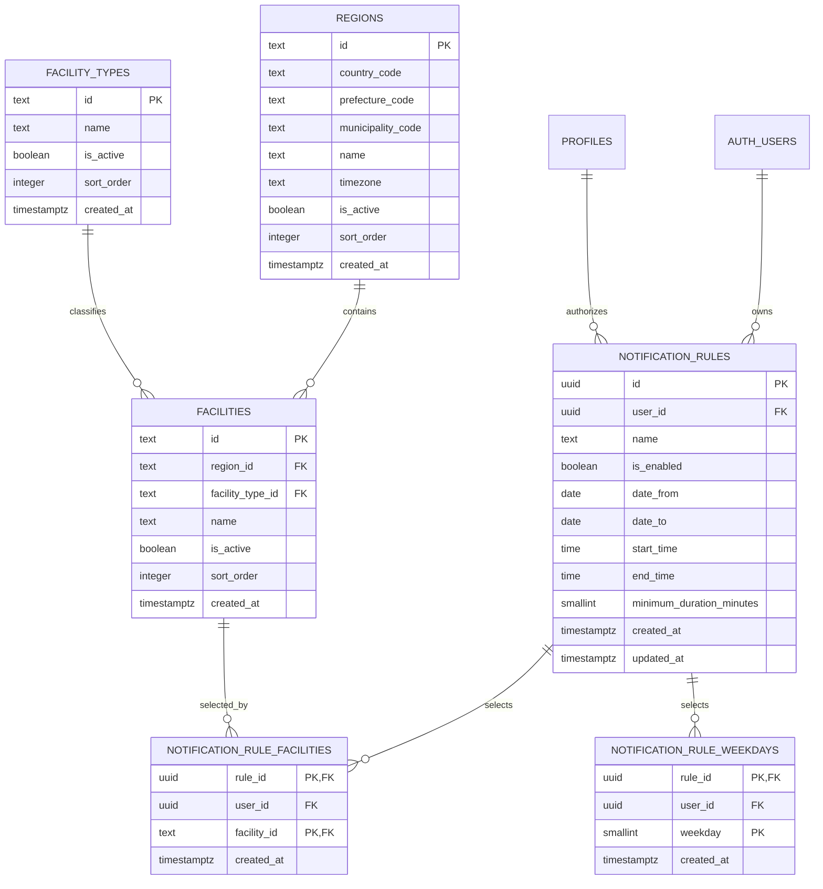

# Phase 2 通知条件データモデル設計

## 1. 目的と責務境界

本書は、Phase 2で使用する地域・施設マスター、利用者ごとの通知条件を保存するデータモデル、通知条件UI、原子的保存RPC、空き候補との照合エンジンを定義する。テーブル・RLS・初期マスターは `supabase/migrations/20260807000000_create_notification_rules.sql`、原子的保存RPCは `supabase/migrations/20260807100000_add_notification_rule_save_rpc.sql`、照合処理専用の取得RPCは `supabase/migrations/20260807110000_add_notification_rule_matching_rpc.sql`、1利用者5件の上限は `supabase/migrations/20260807130000_limit_notification_rules_per_user.sql` に含める。

Phase 2は完了である。通知条件の一覧・新規作成・編集・削除・一時停止・有効化UI、条件本体・施設・曜日を1トランザクションで保存する `save_notification_rule` RPC、有効な条件と空き候補を照合する純粋Pythonエンジン、1利用者5件の条件数上限を実装済みである。migrationの適用状況は環境ごとに確認する。

Phase 3の責務は、利用者別メール送信、配信キュー、再試行、delivery feedback、配信停止・再有効化、retentionである。これらはPhase 2のテーブルやmigrationへ含めず、Phase 3で実装しproduction acceptanceまで完了した。

## 2. テーブル一覧

| テーブル | 種別 | 用途 |
| --- | --- | --- |
| `public.regions` | マスター | 国・都道府県・市区町村とタイムゾーン |
| `public.facility_types` | マスター | テニスコートなどの施設種別 |
| `public.facilities` | マスター | 利用者が通知条件で選択する施設 |
| `public.notification_rules` | 利用者データ | 通知条件の本体 |
| `public.notification_rule_facilities` | 利用者データ | 通知条件と施設の多対多関連 |
| `public.notification_rule_weekdays` | 利用者データ | 通知条件と曜日の多対多関連 |

## 3. ER関係

`profiles` はPhase 1の既存テーブルである。RLSは `profiles.id` と認証利用者を照合し、`membership_status = 'active'` の本人だけに利用者データの操作を許可する。

## 4. カラム定義

### 4.1 `regions`

| カラム | 意味 |
| --- | --- |
| `id` | 表示名から独立した安定地域ID |
| `country_code` | ISO 3166-1 alpha-2形式の国コード。初期値は `JP` |
| `prefecture_code` | 都道府県コード。鹿児島県は `46` |
| `municipality_code` | 市区町村コード。鹿児島市は `46201` |
| `name` | 地域表示名 |
| `timezone` | 条件時刻の評価に使うIANAタイムゾーン |
| `is_active` | 新規選択肢として使用可能か |
| `sort_order` | UI表示順 |
| `created_at` | DB登録時刻 |

すべての文字列列は空白だけの値を許可しない。初期地域は `jp-kagoshima-kagoshima-city` である。

### 4.2 `facility_types`

| カラム | 意味 |
| --- | --- |
| `id` | 安定施設種別ID |
| `name` | 施設種別表示名 |
| `is_active` | 新規選択肢として使用可能か |
| `sort_order` | UI表示順 |
| `created_at` | DB登録時刻 |

初期種別は `tennis-court`（テニスコート）である。地域と施設種別を別マスターにすることで、将来の地域・体育館・野球場・会議室などを追加できる。

### 4.3 `facilities`

| カラム | 意味 |
| --- | --- |
| `id` | `availability.json` と共有する安定施設ID |
| `region_id` | 所属地域 |
| `facility_type_id` | 施設種別 |
| `name` | 施設表示名 |
| `is_active` | 新規通知条件で選択可能か |
| `sort_order` | UI表示順 |
| `created_at` | DB登録時刻 |

### 4.4 `notification_rules`

| カラム | 意味 |
| --- | --- |
| `id` | DB生成の通知条件UUID |
| `user_id` | 所有者である `auth.users.id` |
| `name` | 利用者が識別する条件名。空白不可、80文字以内 |
| `is_enabled` | 照合対象として有効か。初期値は `false` |
| `date_from` | 対象開始日。`null` は開始日の下限なし |
| `date_to` | 対象終了日。`null` は終了日の上限なし |
| `start_time` | 対象時間帯の開始 |
| `end_time` | 対象時間帯の終了 |
| `minimum_duration_minutes` | 必要な最低連続時間。30〜720分の30分単位 |
| `created_at` | DB登録時刻 |
| `updated_at` | DB triggerで更新する最終更新時刻 |

時刻はタイムゾーンを列自体に持たない。照合時には、選択された施設が属する `regions.timezone` を使用して解釈する。複数施設を選ぶ場合も施設ごとの地域タイムゾーンで個別に評価する。

`is_enabled` の初期値を `false` とするのは、本体作成後に施設と曜日を登録する間の不完全な条件が誤って有効扱いになることを防ぐためである。

### 4.5 `notification_rule_facilities`

| カラム | 意味 |
| --- | --- |
| `rule_id` | 通知条件ID |
| `user_id` | 通知条件の所有者ID |
| `facility_id` | 選択施設ID |
| `created_at` | DB登録時刻 |

主キーは `(rule_id, facility_id)` とする。`(rule_id, user_id)` から `notification_rules(id, user_id)` への複合外部キーにより、別利用者の通知条件へ施設を紐付けられない。

### 4.6 `notification_rule_weekdays`

| カラム | 意味 |
| --- | --- |
| `rule_id` | 通知条件ID |
| `user_id` | 通知条件の所有者ID |
| `weekday` | ISO 8601曜日番号 |
| `created_at` | DB登録時刻 |

主キーは `(rule_id, weekday)` とする。施設関連と同様の複合外部キーにより所有者整合性を保証する。

曜日はISO 8601に従う。

| 値 | 曜日 |
| --- | --- |
| 1 | 月曜日 |
| 2 | 火曜日 |
| 3 | 水曜日 |
| 4 | 木曜日 |
| 5 | 金曜日 |
| 6 | 土曜日 |
| 7 | 日曜日 |

DBのcheck制約で1〜7だけを許可する。

## 5. 施設IDと公開空きデータ

施設マスターのID・名称は `scripts/scrape.py` および `data/availability.json` と一致させる。別名や独自IDを作らない。

| `facilities.id` / `availability.json.facility_id` | 施設名 |
| --- | --- |
| `kamoike-prefectural` | 鴨池県営テニスコート |
| `sumizei` | SuMIzeiテニスコート |
| `toukai-tennis` | 東開庭球場 |

3施設はいずれも地域 `jp-kagoshima-kagoshima-city`、施設種別 `tennis-court` に属する。

## 6. 整合性と未完成条件

DBは文字列、時間順序、日付範囲、最低連続時間、曜日、外部キー、所有者の整合性を保証する。一方、通知条件本体を作ってから子テーブルを登録できるよう、施設または曜日が0件の不完全な条件もDB上は保存可能とする。

Phase 2のUIと `save_notification_rule` RPCは、保存完了前に施設1件以上、曜日1件以上を必須検証する。UIは停止中の条件を有効化する前にも、現在読み込んでいる施設・曜日がそれぞれ1件以上あることを確認する。照合エンジンでも、施設または曜日が0件の条件を `is_enabled` の値にかかわらず無効として扱う。

通知条件は1利用者あたり最大5件とする。有効な条件と停止中の条件を区別せず、`notification_rules` に保存された全件を数える。0〜4件のときは新規追加でき、5件では新規追加を拒否する。5件ある状態でも既存条件の編集・有効化・一時停止・削除は可能であり、削除して4件以下になれば再び追加できる。

最終的な強制箇所は `public.notification_rules` の `before insert or update of user_id` triggerである。`public.enforce_notification_rule_limit()` は `security invoker`、`set search_path = ''` と完全修飾したSQLオブジェクト名・組込み関数を使用し、RLSを変更しない。新規作成または所有者変更時に `new.user_id` から安定した64bitキーを生成して `pg_catalog.pg_advisory_xact_lock()` を取得し、その後で移動先利用者の既存件数を数える。同一利用者の並行作成をtransaction単位で直列化するため、同時要求でも6件以上にならない。所有者が変わらないUPDATEは上限判定を行わず、所有者変更では更新対象自身を件数から除外する。

上限migrationは適用前に、既に6件以上の条件を持つ利用者がいないことを検査する。該当データがある場合は利用者IDやメールアドレスを出さずにmigrationを失敗させる。trigger関数の直接実行権限は `PUBLIC`、`anon`、`authenticated` から剥奪し、trigger経由の実行だけを維持する。

通知条件UIは「登録済み n / 5件」を表示し、5件で「新しい通知条件」ボタンを無効化して削除案内を表示する。新規フォームを開く時点と保存直前にも現在件数を確認するが、編集は上限判定の対象外とする。DBの並行作成競合で上限エラーになった場合は日本語の案内へ変換し、一覧を再取得して実際の件数、案内、ボタン状態を同期する。再取得に失敗した場合は追加操作を止め、ページ再読み込みを求める。DOM構築にはDOM APIと `textContent` を使用する。

## 7. RLSと権限

6テーブルすべてでRLSを有効にする。RLSに加え、テーブル権限をいったん `PUBLIC`、`anon`、`authenticated` から剥奪して必要最小限だけ再付与する。

マスター3テーブルは `authenticated` にSELECTだけを許可する。`anon` は参照できず、ブラウザの認証利用者もINSERT、UPDATE、DELETEできない。

利用者データ3テーブルは、各SELECT、INSERT、UPDATE、DELETE policyで次の両方を確認する。

- `(select auth.uid()) = user_id` で本人所有行である。
- 本人の `public.profiles.membership_status = 'active'` である。

INSERTは `WITH CHECK`、UPDATEは `USING` と `WITH CHECK`、DELETEは `USING` を使用する。UPDATE後にも本人IDを検証するため、`user_id` を他人へ変更できない。子テーブルではRLSに加えて `user_id` を含む複合外部キーを使用し、親条件との所有者整合性をDB制約でも保証する。

active確認は既存 `profiles` の本人SELECT RLSを利用した単純な `exists` で行う。既存RLSの無効化・緩和や、新しい `security definer` 関数は行わない。

`save_notification_rule` は `security invoker`、`set search_path = ''` のまま実行し、利用者ID引数を受け取らない。新規作成では `auth.uid()` を `user_id` に使用し、編集では条件IDと `auth.uid()` の両方に一致する本人所有行だけを更新する。本体・施設・曜日の全保存が成功した場合だけ条件IDを返し、途中の例外ではRPC呼び出し全体をロールバックする。実行権限は `PUBLIC` と `anon` から剥奪し、`authenticated` だけへ付与する。

新規保存は `notification_rules` へのINSERTを通るため、`save_notification_rule` RPC経由の6件目も上限triggerが拒否する。既存条件の編集は `user_id` を変更しないUPDATEであるため、5件ある状態でも保存できる。RPCの署名、`security invoker`、RLSは変更しない。

`list_notification_rules_for_matching()` はGitHub Actionsなどの信頼されたサーバー処理専用である。`security invoker`、`stable`、`set search_path = ''` と完全修飾したオブジェクト名を使用し、既存RLS・policyを変更しない。active会員の有効かつ施設・曜日が各1件以上ある条件だけを返す。返却列は条件ID、利用者ID、日付範囲、開始・終了時刻、最低時間、施設ID配列、ISO曜日配列だけとし、メールアドレスは返さない。施設ID配列とISO曜日配列は重複排除してソートする。実行権限は `PUBLIC`、`anon`、`authenticated` から剥奪し、`service_role` だけへ付与するため、ブラウザのpublishable keyからは呼び出せない。

このRPCは `security invoker` であるため、`service_role` のRLS bypassとは別に、内部で参照するテーブルの通常のSELECT権限を必要とする。`20260807120000_grant_notification_matching_rpc_dependencies.sql` は `public.profiles`、`public.notification_rules`、`public.notification_rule_facilities`、`public.notification_rule_weekdays` の4テーブルだけにSELECTを付与する。INSERT、UPDATE、DELETE等の書込み権限、他テーブル、`PUBLIC`、`anon`、`authenticated` への権限は追加しない。RPCは引き続き `security invoker` と既存RLSを維持する。

## 8. 空き候補との照合

`scripts/match_notification_rules.py` は外部通信と分離した純粋関数を中心に構成する。通知条件は `rule_id`、`user_id`、`is_enabled`、任意の `date_from` / `date_to`、`start_time` / `end_time`、`minimum_duration_minutes`、`facility_ids`、ISO 8601の `weekdays` を正規化して評価する。

照合対象は、`availability.json` で日別entryの `status` が `success` かつ、枠の `status` が `available` のデータだけである。`error`、`selector_pending`、`fallback_from_previous` など正常取得でない日付に保持された過去データから、新しい一致候補を生成しない。

条件は次をすべて満たした場合に一致する。

- 条件が有効で、施設と曜日がそれぞれ1件以上ある。
- 施設IDと、空き日付から求めたISO 8601曜日番号が一致する。
- `date_from` がある場合はその日以降、`date_to` がある場合はその日以前である。境界日は含む。
- 条件時間帯と空き時間帯が実際に重なる。
- 重複部分の時間が `minimum_duration_minutes` 以上である。

最低時間の判定には枠全体の `duration_minutes` ではなく、条件時間帯との重複時間を使う。例えば空きが08:30〜13:00、条件が09:00〜11:00、最低120分なら一致する。空きが10:00〜13:00で同じ条件・最低時間なら、重複は60分だけなので一致しない。祝日専用条件は設けず、月曜日の祝日は月曜日の条件だけに一致する。

## 9. 照合結果と重複排除

結果は利用者と `slot_id` の組み合わせを1件とする。同じ利用者の複数条件が同じ枠へ一致しても候補は1件にまとめ、`matched_rules` に条件ID、重複開始・終了時刻、重複分数を保持する。別利用者が同じ枠へ一致した場合は別候補とする。枠、候補、`matched_rules` は安定IDと日時で決定的にソートし、重複した入力枠も `slot_id` 単位で除去する。

この結果はPhase 3がメールなどの各チャネルへ展開するためのプロセス内データであり、Phase 2では配信済み判定、キュー、再試行、通知履歴、実送信を行わない。利用者ID・条件IDを含むmatch詳細は `data/`、GitHub Pages、公開Artifactへ保存せず、CLIは評価条件数・枠数・利用者数・枠数・候補数の集計だけを出力する。

## 10. Supabase取得とGitHub Actions

CLIは標準ライブラリ `urllib` で `list_notification_rules_for_matching()` を呼び出す。HTTPSの `SUPABASE_URL` と `SUPABASE_SERVICE_ROLE_KEY` を必要とし、timeoutを設定する。Authorization header、apikey、service-role key、HTTPレスポンス本文、利用者ID、条件IDをログへ出さず、不正なJSONやルール形式では詳細を公開せず失敗する。新しい外部Pythonパッケージは使用しない。

Phase 2完了時点では、GitHub Actionsでスクレイピング後に `ENABLE_NOTIFICATION_MATCHING=true` の場合だけ照合するシャドーモードとして導入した。match詳細や結果ファイルをArtifactやPagesへ保存せず、`SUPABASE_URL` と `SUPABASE_SERVICE_ROLE_KEY` は照合stepだけへ渡す境界は現在も維持する。

その後Phase 3.4.2で `matching -> enqueue -> dispatch` のscheduled production pathを有効化し、利用者別メールの自動配信を確認した。Phase 3.4.3で単一通知先のlegacy LINE経路とstate fileを退役した。したがって本節のシャドーモードとlegacy LINEに関する記述はPhase 2導入時点の実装履歴である。

Actionsを有効化するにはRepository Variable `ENABLE_NOTIFICATION_MATCHING=true` と `SUPABASE_URL`、Repository Secret `SUPABASE_SERVICE_ROLE_KEY` が必要である。service-role keyはブラウザ公開設定やジョブ全体の環境変数へ置かない。

## 11. 現在の空き取得範囲

現在のスクレイパーは、今日を含む直近15日間の土日・日本の祝日、8:00〜13:00について、連続60分以上の空き候補を生成する。

通知条件の最低連続時間は30分以上を指定できる。例えば60分以上の取得済み空き候補と通知条件時間帯が30分以上重なり、条件の最低連続時間が30分なら一致し得る。通常の平日や8:00〜13:00外は現在のMonitoring Policyでは取得しないため、その範囲だけを希望する条件には候補が生成されない。平日の曜日を選択していても、その日が日本の祝日として取得対象になっている場合は一致し得る。

`account/notifications.html` には現行取得範囲の案内を表示している。監視範囲外の条件を保存可能なまま警告するUXと、60分未満を希望する条件の説明はLaunch Readiness GateのMonitoring Policy UXで現在の照合仕様へ整合させる。

## 12. migrationの適用とロールバック

通知条件テーブルmigrationの後に、原子的保存RPC migration、照合処理専用RPC migration、service-role依存テーブルSELECT migration、1利用者5件の上限migrationの順で各1回だけ適用する。適用済みmigrationを編集・再実行せず、修正が必要な場合は新しいタイムスタンプのmigrationを追加する。

適用前に、対象Supabaseプロジェクトと環境、SQL全文、RLS、Grant、初期データ、利用者ごとの既存通知条件数をレビューする。上限migrationは6件以上を持つ利用者が存在すると匿名のエラーで停止する。空の検証環境では全migrationを時系列順に適用し、複数の架空ユーザーで本人・他人・inactive会員・anonの操作、5件時の編集、6件目の拒否、同一利用者の並行作成を実DB検証する。

このmigrationには自動down migrationを用意しない。適用直後かつ利用者データがない検証環境で戻す必要がある場合だけ、子テーブル、`notification_rules`、施設、施設種別、地域の順で依存関係を確認して削除し、triggerと専用functionも削除する。本番データが存在する環境では安易にテーブルをdropせず、バックアップと復元手順を確認したうえで前方修正migrationを優先する。

本リポジトリへのmigration追加だけではSupabase環境へ自動適用されない。適用状況は対象環境ごとにmigration履歴を確認し、未適用分だけを時系列順に適用する。
