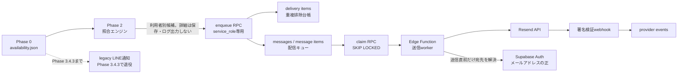

# Phase 3 利用者別メール通知キュー・配信ライフサイクル設計

## 0. 文書の読み方と現在状態

Phase 3は2026-08-19にproduction acceptanceまで完了した。

本書にはPhase 3.1から3.5cまでを段階導入した際の
「今回のPR」「後続PR」「legacy LINEを維持する」等の歴史的記述を意図的に残す。
現在状態を判断するときは本節、Development Roadmap、
および各Phase 3 Runbookを正とする。

現在、Phase 0の単一通知先legacy LINE経路はPhase 3.4.3で退役済みである。
管理者も一般会員と同じ利用者別notification pipelineを利用する。
Phase 4ではこのlegacy経路を復活させず、会員共通の利用者別LINE通知を追加する。

## 1. 目的と今回の境界

Phase 3は、Phase 2の照合結果を利用者別メール通知へ安全に引き渡すためのDBキュー基盤を対象とする。利用者別LINE通知はPhase 4で扱う。このキュー基盤の構築中は、Phase 0から稼働している既存管理者向けLINE通知を通知先、状態管理、再試行、workflowを含めて変更せず、安全なfallbackとして維持する。ただしこれはlegacy notification pathであり、Phase 3の自動メール配信が本番で安定した後に停止・削除する。

今回の最初のPRでは、次だけを実装する。

- メール通知設定、重複排除台帳、メッセージ、関連、provider eventのDBスキーマ
- enqueueとclaimのservice_role専用RPC
- enum、制約、index、RLS、revoke/grant
- migration SQLを対象とする静的pytest

上記はPhase 3.1の最初のqueue migrationの境界である。その後、Phase 3.2〜3.4でResend送信workerと自動enqueue/dispatchを実装し、Phase 3.5aで署名済みwebhookのdelivery feedback、Phase 3.5bで本人向けunsubscribeと再有効化token rotation、Phase 3.5cで90日retention cleanupを追加した。2026-08-19までにPhase 3.5aのaggregate観察、Phase 3.5bのproduction acceptance、Phase 3.5cのproduction rolloutと初回cron成功を確認し、Phase 3を完了した。forward migrationはリポジトリへの追加だけではSupabase環境へ自動適用されない。

## 2. 確定方針

1. 既存利用者を含むすべての利用者のメール通知は初期OFFとする。
2. メールアドレスはSupabase Authを正とし、public schemaの通知テーブル、JSON payload、provider eventへ複製しない。
3. `unique (user_id, channel, slot_id)` を一度だけ通知対象にするための最終的な正とする。
4. 空き枠がいったん消失して再出現しても、同じ `slot_id` なら再通知しない。
5. enqueueとclaimはservice_role専用とし、`PUBLIC`、`anon`、`authenticated`には実行させない。
6. 配信内部テーブルはRLSを有効にし、ブラウザroleへpolicyもテーブル権限も付与しない。
7. GitHub Actions、標準出力、例外、ログへ利用者ID、メールアドレス、通知条件ID、provider応答本文を出さない。
8. 配信データの保存期間は初期90日とし、削除処理はPhase 3.5cとして別実装する。

## 3. 全体構成



Phase 3.1時点の後続責務を含め、現在はqueue、worker、Resend API、webhook、provider eventまでが実装済みである。Phase 0のlegacy管理者LINE経路はPhase 3.4.3で退役し、管理者も通常の利用者別通知pipelineを利用する。Phase 4でも管理者専用LINE経路は再構築せず、会員共通LINE notification基盤を使用する。

## 4. 責務分離

| コンポーネント | 責務 | 保持・出力してはいけないもの |
| --- | --- | --- |
| Phase 2照合 | 有効な通知条件と正常取得できた空き枠の照合、候補の決定的な生成 | メールアドレス、公開Artifactへのmatch詳細 |
| enqueue RPC | JSON検証、会員・設定・条件の再確認、重複排除、利用者単位のpending message作成 | 個別IDを含むRPC結果、メールアドレス |
| delivery item | 利用者・channel・安定slot IDの一度限り台帳、送信表示用snapshot | 宛先、認証情報 |
| message | claim、lease、試行回数、再試行、provider結果の状態管理 | 宛先、providerのraw応答 |
| claim RPC | 配信資格の再確認、不適格messageのcancel、競合しないbounded batchの取得とprocessingへの遷移 | メールアドレス、通知条件ID |
| 送信worker | claimされた`user_id`を使う送信直前のAuth Admin API宛先解決、本文生成、correlation tagと冪等性keyを伴うResend API呼び出し | secret、利用者ID、宛先のログ出力 |
| Resend webhook | raw bodyのSvix署名検証、event重複排除、provider時刻順の状態反映 | raw webhook payload、宛先、sender、subjectの保存・ログ出力 |
| unsubscribe token/RPC | 利用者単位のcapability発行、message単位の取得、本人opt-out、再有効化時rotation | browser roleのdirect token参照、provider suppression理由の上書き |
| unsubscribe Edge Function | side effectなしの確認GET、人間POST、RFC 8058 one-click POST、generic response | token、query、利用者ID、メールアドレスのログ出力 |
| Supabase Auth | メールアドレスの唯一の保存元 | notification public schemaへの複製 |

claimは内部message ID、`user_id`、非個人の表示用itemsをservice_roleだけへ返す。送信Edge Functionは`user_id`をSupabase Auth Admin APIへ渡し、メールアドレスを送信直前だけメモリ上で解決する。メールアドレスはclaim結果、public schema、永続payloadへ含めない。`user_id`も通常ログ、GitHub Actions、Artifactへ出さない。

## 5. データモデル

### 5.1 `notification_email_preferences`

利用者ごとのメール通知opt-inを保持する。`user_id`は`auth.users.id`を参照する主キーで、`is_enabled`は`false`が初期値である。migration時に既存Auth利用者をfalseでbackfillし、以後はAuth利用者作成triggerでfalseの行を作る。したがって、行がまだ存在しない場合も含めて暗黙に有効とは扱わない。

保持列は`user_id`、`is_enabled`、`disabled_reason`、`disabled_at`、`created_at`、`updated_at`であり、メールアドレス列は作らない。

active会員本人には自分の行のSELECTと`is_enabled`列だけのUPDATEを許可する。INSERT、DELETE、`disabled_reason`、`disabled_at`の直接更新は許可しない。provider起因のbounce、complaint、suppressionなどを後続の信頼済み処理が`disabled_reason`へ設定した場合、理由を残したまま利用者が再有効化できない制約にする。

### 5.2 `notification_delivery_items`

次を保持する。

- `user_id`
- `channel`
- `slot_id`
- `facility_id`
- `facility_name`
- `available_date`
- `start_time`
- `end_time`
- `matched_rule_ids`
- `payload`
- `created_at`

`facility_name`、日時、payloadは送信表示用snapshotである。`matched_rule_ids`はenqueue時点でも同じ利用者の有効な条件だけへ絞り直す。payloadはJSON object、16 KiB以下とし、許可するtop-level fieldを`court_name`と`reservation_url`だけに限定する。各fieldは文字列、空白不可、`court_name`は200文字以下、`reservation_url`は2048文字以下である。通知条件IDは専用列だけに保持し、claim結果へ含めない。

payloadのDB制約は構造、型、サイズの保証を担当し、メールアドレスらしい文字列を正規表現で検出する責務は持たない。trusted producerはPhase 2候補から許可fieldだけを新しいobjectへコピーし、任意の入力objectやprovider bodyをそのまま渡さない。

`(user_id, channel, slot_id)`の一意制約が重複防止の正である。アプリケーションの事前確認は最適化にすぎず、並行enqueueでも`ON CONFLICT DO NOTHING`と一意制約が新規行を1件に限定する。

### 5.3 `notification_messages`

利用者単位の送信試行を表し、次を保持する。

- `user_id`、`channel`、`status`
- `attempt_count`、`next_attempt_at`
- `locked_at`、`locked_until`
- `provider_message_id`、`provider_status`
- `last_error_code`、`last_error_message`
- `accepted_at`、`delivered_at`、`failed_at`
- `created_at`、`updated_at`

enqueue 1回の中で新規delivery itemが存在した利用者・channelごとにpending messageを1件作る。重複候補しかない利用者にはmessageを作らない。`last_error_message`には正規化・匿名化した文だけを保存し、providerのraw応答、宛先、利用者IDを保存しない。

status enumは次の10値である。

| status | 意味 |
| --- | --- |
| `pending` | 初回claim待ち |
| `processing` | workerがlease中 |
| `accepted` | providerが送信要求を受理 |
| `delivered` | providerが配信完了を通知 |
| `retry_wait` | 一時失敗後、`next_attempt_at`まで待機 |
| `failed_permanent` | 再試行しない恒久失敗 |
| `bounced` | bounce eventを受信 |
| `complained` | complaint eventを受信 |
| `suppressed` | 配信停止・provider suppression |
| `cancelled` | 運用上キャンセル |

### 5.4 `notification_message_items`

messageとdelivery itemを関連付ける。複合外部キーに`user_id`と`channel`を含め、異なる利用者またはchannelを誤って関連付けられないようにする。`delivery_item_id`を一意にし、同じ一度限りのdelivery itemを複数messageへ入れない。

### 5.5 `notification_provider_events`

Resend webhookを正規化して保存する。provider、provider event ID、必須のprovider message ID、event type、provider status、発生時刻を保持し、`(provider, provider_event_id)`でwebhook再送を重複排除する。`(message_id, provider_message_id)`の複合外部キーにより、eventのprovider message IDが同じ`notification_messages`行に記録された値と一致することをDBで保証する。

raw webhook payload、header、メールアドレスは保存しない。Phase 3.5a production rollout後は署名済みwebhookから正規化したeventだけを書き込む。

### 5.6 `notification_email_unsubscribe_tokens`

`user_id`を主キー、ランダムな`token`をunique capabilityとして保持する。既存preferenceはforward migrationでbackfillし、新規preference作成triggerでも自動作成する。RLSを有効にしたうえで`PUBLIC`、`anon`、`authenticated`、`service_role`を含む直接table privilegeを剥奪し、security-definer RPCだけを境界とする。メールアドレスは保持しない。

## 6. enqueue RPC

`public.enqueue_email_notification_candidates(jsonb)`はservice_role専用の`security definer`関数で、`set search_path = ''`と完全修飾名を使用する。入力はJSON配列で、1回500件を上限とする。空配列は安全なno-opとして全件数0を返す。

各要素は次の10項目だけを必須とする。

| key | 型・制約 |
| --- | --- |
| `user_id` | UUID文字列 |
| `channel` | 現在は文字列`email`だけ |
| `slot_id` | 空白不可、200文字以下 |
| `facility_id` | activeな既存施設ID |
| `facility_name` | 施設マスターと一致、200文字以下 |
| `available_date` | `YYYY-MM-DD`形式の有効な日付 |
| `start_time` / `end_time` | 有効な時刻で、開始が終了より前 |
| `matched_rule_ids` | UUID文字列の配列、1〜5件 |
| `payload` | JSON object、16 KiB以下、`court_name`と`reservation_url`だけ。値のPII排除はtrusted producerが担当 |

入力全体を検証してから書き込むため、不正な1件がある場合は個別値を例外へ含めず、RPC全体を失敗させる。正しい形でも、書込み直前に次を再確認する。

- `profiles.membership_status = active`
- `notification_email_preferences.is_enabled = true`
- `disabled_reason is null`
- 候補に含まれる通知条件が同じ利用者の現在も有効な条件である

同じ`(user_id, channel, slot_id)`の入力が複数ある場合は、facility、日付、時刻、payloadのsnapshotがすべて一致することを先に確認する。矛盾するsnapshotは入力全体を拒否する。一致する候補の`matched_rule_ids`はunionして重複排除し、その後で現在も本人所有かつ有効なruleだけへ絞る。これにより、先頭候補のruleが無効でも後続候補の有効なruleを失わない。

正規化後、delivery itemを`ON CONFLICT DO NOTHING`で登録する。新規delivery itemからだけ利用者単位のpending messageと関連行を作る。結果は入力件数、新規delivery item件数、新規message件数、関連件数の集計だけで、利用者ID、通知条件ID、delivery item ID、message IDを返さない。

## 7. claim、並行worker、リトライ

`public.claim_email_messages(batch_size)`もservice_role専用の`security definer`関数である。`batch_size`は1〜100に限定する。

claim対象は次である。

- active会員で、email preferenceが有効かつ`disabled_reason`がない利用者のmessage
- `pending`または`retry_wait`で、`next_attempt_at`が到来し、leaseされていないmessage
- worker停止などで`processing`の`locked_until`が過ぎたmessage

RPCは、`pending`、`retry_wait`、またはlease切れ`processing`でありながら、active会員・通知有効・停止理由なしの条件を満たさないmessageを先にロックして`cancelled`へ更新し、lock時刻を消去する。このcancellationと適格messageのclaimは同じRPC transaction内で行う。cancellationも1回につき`batch_size`件を上限とし、大量停止時は後続claimで継続する。

適格候補の取得には`FOR UPDATE SKIP LOCKED`を使用する。同一transactionでstatusを`processing`へ変え、`attempt_count`を増やし、`locked_at`と5分後の`locked_until`を設定する。複数workerが同じmessageを同時取得せず、停止したworkerのmessageもlease満了後に再取得できる。

claim結果はmessage ID、`user_id`、channel、試行回数、lease期限、表示用itemsである。メールアドレス、通知条件ID、slot ID、delivery item IDは含めない。`user_id`はservice_role専用のEdge FunctionがAuth Admin APIで宛先を解決するためだけに使い、ログへ出さない。

後続PRでは、失敗を一時失敗と恒久失敗へ分類する。一時失敗は指数backoffとjitterを使って`retry_wait`と`next_attempt_at`を設定し、最大試行回数または最大経過時間を超えたら`failed_permanent`へ移す。HTTP 429、timeout、provider 5xxは原則一時失敗、入力不正や恒久的なprovider拒否は恒久失敗とする。具体的な最大試行回数、backoff間隔、完了更新RPCは送信worker実装PRで確定する。

## 8. 重複防止と再出現

Phase 2は同じ利用者の複数条件が同じ枠へ一致した結果を1候補へまとめる。Phase 3はさらにDBの一意制約で並行実行と再実行を防ぐ。

```text
Phase 2候補の集約
  → enqueue入力内の重複排除
  → unique (user_id, channel, slot_id)
  → 新規delivery itemだけmessageへ関連付け
```

送信失敗時は同じmessageを再試行し、新しいdelivery itemを作らない。空き枠が消失してもdelivery itemを削除しないため、監視期間中に同じ`slot_id`が再出現しても再通知しない。provider受理済みかどうかに関係なく、一度delivery itemになった枠は同じ利用者・channelでは新規候補に戻さない。

## 9. RLSと権限

配信テーブルすべてでRLSを有効にし、テーブル権限を`PUBLIC`、`anon`、`authenticated`からいったん剥奪する。unsubscribe token tableは`service_role`の直接権限も剥奪する。

`notification_email_preferences`だけは、activeな`authenticated`本人にSELECTと`is_enabled`列のUPDATEを許可する。利用者IDの変更、行作成・削除、配信停止理由の変更は許可しない。

残り4つは内部配信データである。ブラウザrole向けpolicyを作らず、テーブル権限も再付与しない。RLSと権限の二重境界により、publishable keyや利用者JWTから直接参照・更新できない。

enqueueとclaimは目的を限定したservice_role専用RPCとしてだけ公開する。両RPCとAuth新規利用者triggerは`security definer`、空のsearch path、完全修飾名を使用する。関数の既定EXECUTE権限を`PUBLIC`、`anon`、`authenticated`から明示的に剥奪する。

## 10. 個人情報とログ

メールアドレスの正は`auth.users`だけである。次の場所へメールアドレスを保存しない。

- `notification_email_preferences`
- delivery itemの列・payload
- messageのprovider状態・エラー文
- provider event
- `data/`、GitHub Pages、Actions Artifact、fixture

enqueueは利用者IDと通知条件IDを入力・内部処理に必要とするが、RPC結果とエラーへ値を含めない。claimはtrusted workerの宛先解決用に`user_id`を返すが、メールアドレスと通知条件IDは返さない。将来のworker、webhook、運用CLIは、件数、status、処理時間、匿名のエラーcodeだけを構造化ログへ出す。Resend API key、Authorization header、request/response body、webhook body、メールアドレス、利用者ID、通知条件ID、message IDを通常ログへ出さない。

payloadはDBで許可field、JSON型、文字列長、全体サイズを制約する。メールアドレス形式の正規表現CHECKは、誤検知と回避の両方があるため使用しない。`last_error_message`にも同様の正規表現CHECKを設けず、trusted writerがprovider応答から許可済みのerror codeと匿名化済みの一般文だけを構築する。DB制約を個人情報検出の正とせず、producerのallowlist生成、送信直前だけのAuth参照、非ログ化を正とする。

## 11. Resend送信とdelivery feedback

利用者別通知の送信providerはResendである。Phase 1のSupabase Auth Custom SMTPと同じ送信ドメインを利用できるが、認証メールと空き通知ではAPI key、テンプレート、メトリクス、配信停止の責務を分離する。

送信workerは、claimで受け取った`user_id`を使うSupabase Auth Admin APIでの送信直前の宛先解決、messageに対応するunsubscribe token取得、テンプレート生成、冪等性keyを伴うResend API呼び出し、acceptedまたはretry状態への原子的更新を担当する。payloadには`tcw_source=user_notification`と`tcw_message_id=<notification_messages.id>`のtag、footer停止リンク、`List-Unsubscribe`、`List-Unsubscribe-Post`を含める。これらを含むexact serialized JSONをHMAC fingerprintとPOST bodyの双方に再利用する。通常retryでは同じtokenを使う。`processing`または`retry_wait`がある間は再有効化とrotationを拒否し、まだfingerprintがない`pending`だけならrotation後のtokenで初回payloadを構築する。API keyとservice role keyはEdge Function secretなどサーバー側だけに置く。

Phase 3.5a webhookは、最初に取得したraw bodyを固定版Svix libraryで検証し、`svix-id`で重複排除する。相関は既存`provider_message_id`を最優先し、見つからない場合だけ自アプリtagのUUIDへfallbackする。tag fallbackでprovider IDをbindできるのは送信前authorizationが`provider_first_attempt_at`と`provider_payload_fingerprint`を記録済みの場合だけである。provider eventはarrival順ではなくtop-level `created_at`の降順、同時刻は`complained > suppressed > bounced > failed > delivered > delivery_delayed > sent`の固定priorityでmessage状態へ反映する。署名不正、未知event、message不一致でも内部IDやbodyをログへ出さず、raw bodyをDBへ保存しない。HTTP契約とrolloutは[Phase 3 Resend Webhook Runbook](./PHASE3_RESEND_WEBHOOK.md)を正とする。

## 12. 配信停止

配信停止には次の2系統がある。

- 利用者操作: `is_enabled = false`にし、以後のenqueue対象から外す。
- provider・運用判断: `is_enabled = false`、正規化した`disabled_reason`、`disabled_at`を設定する。

bounce、complaint、provider suppressionを正常記録した場合は、webhook RPCがmessageを対応statusへ更新し、設定も`resend_bounced`、`resend_complained`、`resend_suppressed`の理由で無効化する。`email.failed`と`delivery_delayed`は無効化せず、`delivered`も自動再有効化しない。`disabled_reason`はauthenticated利用者が直接変更できず、理由が残る間は`is_enabled = true`にできない。Account UIもprovider suppressionを説明してtoggleを無効化し、Resend Suppression Listを自動解除しない。

本人opt-outは、メール内tokenを受けたservice-role RPCが`disabled_reason IS NULL`の場合だけ`is_enabled = false`、`disabled_at = now()`へ変更する。valid、既にOFF、unknown tokenは同じgeneric outcomeにし、provider reasonとtimestampは上書きしない。確認GETは存在確認だけでside effectを起こさず、人間POSTとRFC 8058 POSTだけが停止する。本人が通常のOFF状態からONへ戻すとき、emailの`processing`または`retry_wait`が1件でもあれば更新全体を例外でrollbackし、preference、token、messageを変更しない。0件の場合だけtokenをrotationする。`pending`は再有効化を妨げず、cancelしない。provider suppression状態で拒否された更新でもrotationしない。

配信停止は新規enqueueを止めるだけでなく、claim RPCが未送信のpending、retry_wait、lease切れprocessing messageを配信資格の再確認時に`cancelled`へ移す。現在lease中のprocessing messageは別workerとの競合を避けるためclaimから更新せず、送信workerもAuth宛先解決の直前に配信資格を再確認する。

## 13. 保存期間

初期保存期間は90日とする。対象はmessage、message item、provider event、delivery itemである。今回cleanup jobは作らず、検索と将来削除のため`created_at`、`occurred_at`にindexを用意する。

delivery itemは重複防止の正なので、単純にmessageと同時削除しない。少なくとも作成から90日経過し、かつ`available_date`が監視対象になり得ない過去になったものだけを削除する。現在の15日先までの取得範囲では90日保持により再出現期間を十分に覆う。将来90日を超える先の枠を監視する場合は、同じ`slot_id`を再通知しない条件を壊さないよう保持期間または小さなdedupe tombstoneを先に拡張する。

削除順序、batch上限、実行頻度、監査要件、障害時の再開位置はcleanup実装PRで決める。利用者退会時は`auth.users`からのcascadeを使い、外部provider側のデータ保持は別途確認する。

## 14. 機能フラグと段階的導入

実メール送信はサーバー側機能フラグ`ENABLE_USER_EMAIL_NOTIFICATIONS`を既定falseとして導入済みである。利用者ごとの`is_enabled`だけで全体送信を開始しない。

Phase 3.1で想定した段階的導入は、Phase 3.5cまでproduction rolloutを完了した。Phase 3.5aはaggregate観察まで完了し、Phase 3.5bも[Phase 3 Email Unsubscribe Runbook](./PHASE3_EMAIL_UNSUBSCRIBE.md)のin-flight guardを使用してproduction acceptanceまで完了した。以下の手順はPhase 3.5b rolloutで使用した段階的導入手順として維持する。

1. Phase 3.5b code review: forward migration、sender、Edge Function、Account UI、テストだけを変更し、production操作は分離する。
2. 検証環境: token backfill・rotation、RLS/privilege、generic response、exact provider JSON、UI suppression表示を確認する。
3. production準備: migrationと公開Functionを先に反映し、generic GET/POSTと非PIIログを確認する。
4. sender切替: `retry_wait=0`を事前確認し、`ENABLE_USER_EMAIL_NOTIFICATIONS=false`で新規claimを止め、`processing`/`retry_wait`が0行であることを再確認してからfooter/header追加済みsenderをdeployする。0行でなければdeployを中止し、`retry_wait`発生時はflagを戻して通常workerでdrain後にやり直す。deploy後はflagを戻してcanaryを行う。rollbackも同じmaintenance boundaryを使う。
5. canary: 内部テスト利用者1名で受信、header、確認GET、human POST、RFC 8058 POST、再有効化rotationを確認する。
6. 一般監視: unsubscribe率、Function 5xx、retry滞留、bounce/complaint/suppressionを集計で監視する。

GitHub Actionsへservice role keyや利用者別候補を渡す構成を採用する場合も、secretは必要stepだけへ渡し、候補詳細をファイル、Artifact、job summary、ログへ出さない。今回GitHub Actionsは変更しない。

## 15. Phase 3.5bの対象外

- Phase 3.5bのproduction migration push、Edge Function deploy、sender deploy、Pages deploy、本番canary
- Resend Suppression Listの自動解除とbounce/complaint後の自動再有効化
- cleanup jobと90日削除処理（Phase 3.5c）
- GitHub Actions、Repository Variables、Secrets、workflowの変更
- scheduler watchdog、Cron、既存production configの変更
- 利用者別LINE通知（Phase 4）

production rolloutはコード実装とは分離し、runbookに従って人間が行う。特に既にfingerprintを持つ`processing`/`retry_wait`が存在する状態でunsubscribe footer/headerを追加したsenderへ切り替えない。

## 16. migration適用前後の確認

適用前に対象環境、既存migration履歴、既存Auth利用者数を確認する。空の検証環境でPhase 1、Phase 2、Phase 3の順にmigrationを適用し、少なくとも次を実DBで確認する。

- 既存利用者と新規利用者のpreferenceが初期OFFになる。
- anon、authenticated他人、inactive会員が内部配信データを参照・更新できない。
- active本人は自分のpreferenceだけを参照し、`is_enabled`だけを更新できる。
- 同じ利用者・email・slot IDの並行enqueueでdelivery itemが1件だけになる。
- inactive、通知OFF、停止理由あり、通知条件無効の候補がenqueueされない。
- 複数workerのclaimが同じmessageを返さず、lease満了後は再取得できる。
- enqueue結果、DBエラー、platform logへ個人情報や個別条件IDが出ない。claimの`user_id`はservice-role workerだけが宛先解決に使用し、ログへ出ない。
- Phase 3.5a/3.5b RPCがservice_role以外から実行できず、unsubscribe token tableはservice roleを含めdirect accessできない。
- webhookの重複、順序逆転、direct/tag correlation、conflict/unmatchedが期待どおりで、raw payloadとPIIがDB・ログ・レスポンスへ出ない。

本番適用済みmigrationを編集・再実行しない。修正は新しいtimestampの前方migrationで行う。本番データがある状態での安易なdropやtruncateは行わず、バックアップ、依存関係、復元手順を先に確認する。
